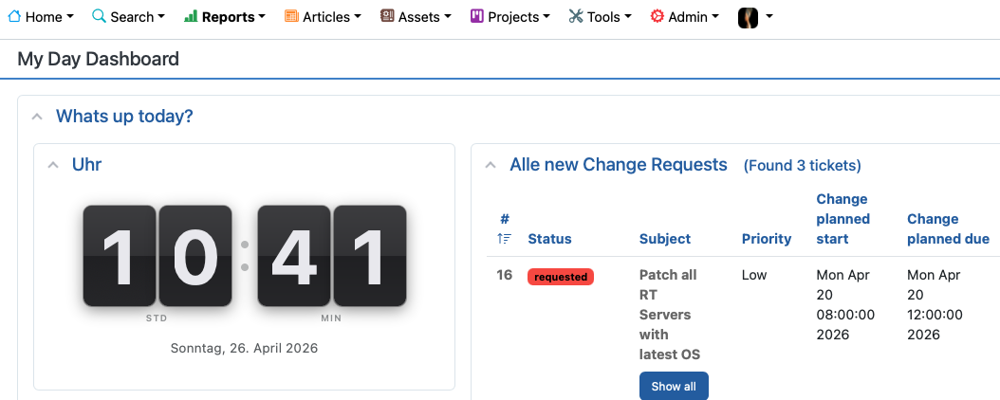

# RT-Extension-ClockWidget

> **Transform your Request Tracker dashboard from functional to beautiful.**

Request Tracker is a powerful tool — but let's be honest, its default dashboard can feel a little utilitarian. **RT-Extension-ClockWidget** is a small but impactful addition that brings a touch of elegance to your RT homepage: a stunning animated flip-clock that displays the current time with the satisfying, tactile feel of a classic split-flap display.

Because a great workspace isn't just about productivity — it's about how it feels to work there.

---

## Screenshot



*The ClockWidget sitting alongside ticket queues on a custom "My Day" dashboard — clean, refined, and always on time.*

---

## Why a Clock Widget?

RT dashboards are visited dozens of times a day. Every glance is an opportunity to make the interface feel polished and intentional rather than purely transactional. The ClockWidget does exactly that:

- **Instant visual anchor** — your eye finds the time immediately, orienting you before you dive into ticket queues
- **A conversation starter** — visitors and new team members notice it; it signals that someone cares about the workspace
- **Zero distraction** — the minimal design communicates the time and nothing else, then steps aside

It is the digital equivalent of putting a well-designed clock on the office wall. Small investment, lasting impression.

---

## Features

- **Classic flip animation** — each digit flips with a smooth CSS 3D fold, faithfully recreating the look and feel of a vintage split-flap display
- **Theme-aware background** — the widget card adapts automatically to RT's active theme (light, dark, KNTheme and beyond) via Bootstrap CSS variables, while the flip panels keep their characteristic dark finish in every context
- **Live updates** — the time ticks forward every second with no page reload required
- **German date line** — displays the full date in German below the clock (`Sonntag, 26. April 2026`)
- **HTMX-safe** — the JavaScript timer monitors its own DOM presence and self-terminates cleanly when the widget is navigated away, leaving no memory leaks or ghost intervals
- **Zero dependencies** — pure HTML, CSS, and vanilla JavaScript; no extra libraries required

---

## Requirements

| Component | Version |
|---|---|
| Request Tracker | 5.0.0 – 6.x |
| Perl | 5.10+ |
| Browser | Any modern browser with CSS 3D Transform support |

---

## Installation

### 1. Get the source

```bash
git clone https://github.com/yourname/RT-Extension-ClockWidget.git
cd RT-Extension-ClockWidget
```

### 2. Build and install

```bash
perl Makefile.PL
make
sudo make install
```

> The extension installs into `/opt/rt6/local/plugins/RT-Extension-ClockWidget/`.

### 3. Register the plugin

Add to `/opt/rt6/etc/RT_SiteConfig.pm`:

```perl
Plugin('RT::Extension::ClockWidget');
```

### 4. Allow the widget component

Add `ClockWidget` to `$HomepageComponents` in `RT_SiteConfig.pm` or a file inside `RT_SiteConfig.d/`:

```perl
Set($HomepageComponents, [qw(
    ClockWidget
    QuickCreate QueueList MyReminders Dashboards
    # ... your existing components
)]);
```

### 5. Clear the Mason cache and restart

```bash
sudo systemctl stop apache2
sudo rm -rf /opt/rt6/var/mason_data/obj/*
sudo systemctl start apache2
```

---

## Usage

1. Navigate to **Home → Dashboard → Edit**
2. Find **ClockWidget** in the available portlets list
3. Drag it into any dashboard column
4. Click **Save**

The widget updates itself every second — no page refresh needed.

---

## Configuration

No additional configuration required. The widget derives all colours and spacing from Bootstrap CSS variables, ensuring it always looks at home regardless of which RT theme is active.

| CSS Variable | Purpose |
|---|---|
| `var(--bs-card-bg)` | Widget container background |
| `var(--bs-secondary-color)` | Separator dots, labels, and date line |

---

## How It Works

### The Flip Animation

Each digit position is built from three stacked layers:

| Layer | Role |
|---|---|
| `.fc-hi` | Static upper half — always shows the current digit |
| `.fc-lo` | Static lower half — immediately updated to the new digit |
| `.fc-fl` | Animated flap — holds the old digit and folds forward via `rotateX(0° → −90°)`, revealing the updated upper half behind it |

When a digit changes, the flap animates away in 360 ms, unveiling the new number in a single fluid motion.

### JavaScript Timer

```js
setInterval(tick, 1000)
```

`tick()` reads `new Date()`, computes each individual digit, and calls `set(digit, value)`. The flip animation only fires when the value has actually changed — keeping CPU usage negligible.

**Self-cleaning:** on every tick the timer checks `document.body.contains(wrapper)`. If the widget has been removed from the DOM (HTMX navigation, dashboard reconfiguration), the interval clears itself automatically — no event listeners, no leaks.

---

## Uninstallation

1. Remove `Plugin('RT::Extension::ClockWidget');` from `RT_SiteConfig.pm`
2. Remove `ClockWidget` from `$HomepageComponents`
3. Delete the plugin directory:
   ```bash
   sudo rm -rf /opt/rt6/local/plugins/RT-Extension-ClockWidget
   ```
4. Clear the Mason cache and restart Apache (see above)

---

## File Structure

```
RT-Extension-ClockWidget/
├── Makefile.PL                    # Module::Install::RTx build script
├── Changes                        # Changelog
├── README.md                      # This file
├── MANIFEST.SKIP                  # Exclusion list for make dist
├── docs/
│   └── screenshot.png             # Dashboard screenshot
├── lib/
│   └── RT/
│       └── Extension/
│           └── ClockWidget.pm     # Perl module (version, POD)
└── html/
    └── Elements/
        └── ClockWidget            # Mason component (HTML + CSS + JS)
```

---

## Changelog

See [Changes](Changes).

---

## License

GNU General Public License v2 —
[https://www.gnu.org/licenses/old-licenses/gpl-2.0.html](https://www.gnu.org/licenses/old-licenses/gpl-2.0.html)

---

## Author

Torsten Brumm
